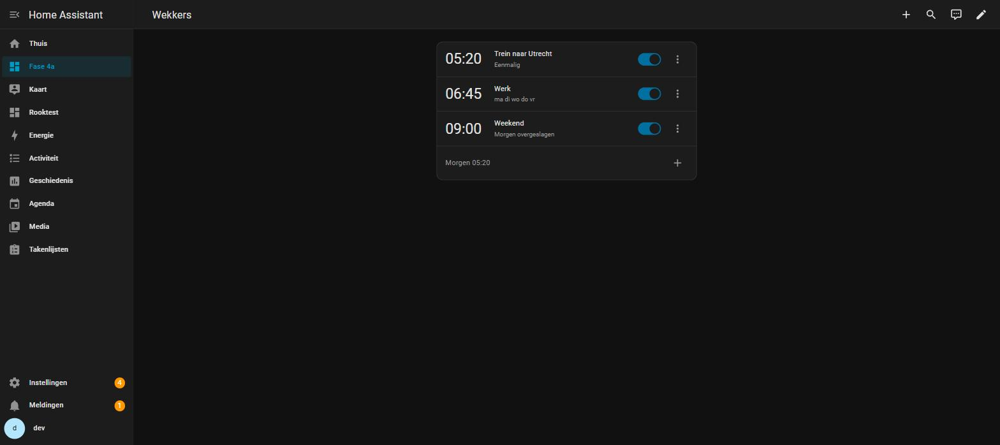
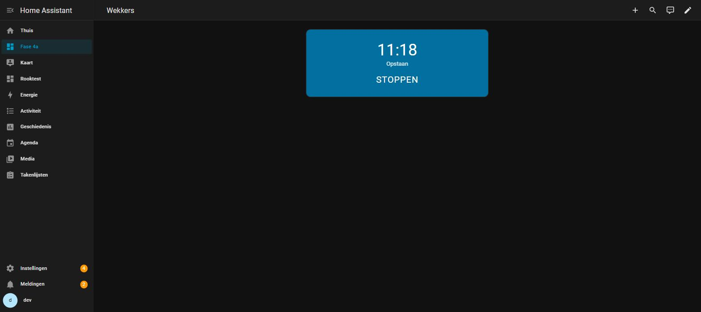
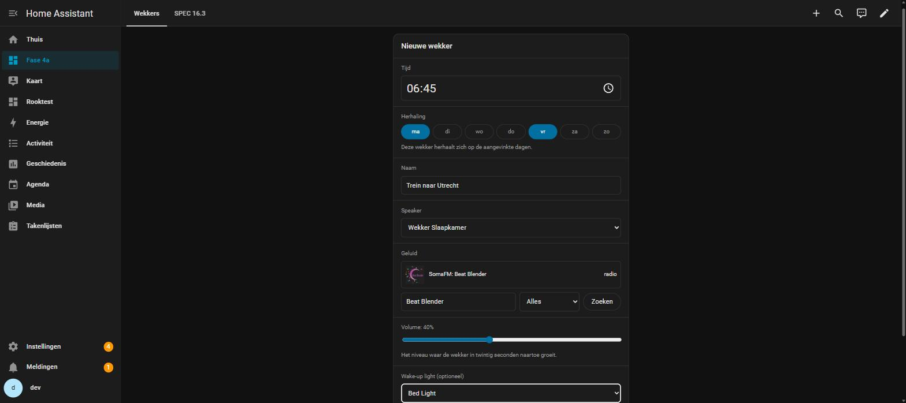

# DomotiApp Alarm

Een wekker voor Home Assistant die je muziek op een Music Assistant-speaker
afspeelt, met een volume dat in twintig seconden van stil naar het ingestelde
niveau groeit, en optioneel een lamp die op de wektijd aangaat.

De wekker gaat af op de ingestelde tijd, **ook als er geen browser openstaat en
ook als Home Assistant vannacht is herstart**. De kaart is de plek waar je
wekkers instelt en waar je ze uitzet; de integratie plant en speelt af,
onafhankelijk van de kaart.

Elke persoon in huis heeft zijn eigen wekkerlijst.



Gaat er een wekker af, dan verandert de kaart in één grote stopknop:



---

## Wat je nodig hebt

| | |
|---|---|
| **Home Assistant 2026.8** of nieuwer | HACS weigert de download op een oudere versie |
| **Music Assistant** | een geladen Music Assistant-integratie met minstens één speaker |
| **Twee labels** | zie hieronder |
| **HACS** | voor de installatie |

### De twee labels

De integratie laat je alleen kiezen uit entiteiten die jij daarvoor hebt
aangewezen. Dat gaat met labels, en die maak je in **Instellingen → Gebieden,
labels en zones → Labels**.

| Label | Zet je op | Waarvoor |
|---|---|---|
| `Music Assistant Wekker` | je Music Assistant-speakers | de speakerkeuze in de editor |
| `Verlichting Wekker` | je lampen | de wake-up light (optioneel) |

De naam moet exact kloppen, inclusief hoofdletters. Hernoem je een label later,
dan blijft alles werken — de integratie onthoudt het label aan zijn interne ID en
niet aan zijn naam.

Een speaker komt alleen in de lijst als hij ook werkelijk een Music
Assistant-speaker is, volume kan instellen, en **geen groep** is. Een
groepsspeaker valt af omdat het volume daar relatief werkt: "begin stil, eindig
op 40 %" levert op een groep een eindvolume op dat afhangt van waar de speakers
gisteravond stonden.

Zie je geen speakers in de editor, dan zegt de editor er ook bij waarom: het
label bestaat nog niet, er hangt niets aan, of de gelabelde entiteiten voldoen
niet aan de eisen.

---

## Installeren

De repository staat niet in de HACS-winkel zelf; je voegt hem toe als **custom
repository**.

1. Open **HACS** in Home Assistant.
2. Klik rechtsboven op de drie puntjes → **Custom repositories**.
3. Vul bij *Repository* in: `https://github.com/Sven2410/domotiapp-alarm`
4. Kies bij *Type*: **Integration**. Klik op **Add**.
5. Zoek in HACS op **DomotiApp Alarm** en klik op **Download**.
6. **Herstart Home Assistant.**
7. Ga naar **Instellingen → Apparaten en diensten → Integratie toevoegen**, zoek
   op **DomotiApp Alarm** en voeg hem toe. Er valt niets in te stellen: één
   bevestiging en klaar.

Na stap 7 registreert de integratie de kaart zelf. **Je hoeft geen
Lovelace-resource toe te voegen.**

## De kaart op een dashboard zetten

1. Open het dashboard waar de kaart moet komen en klik op het potlood.
2. **Kaart toevoegen** → zoek op **DomotiApp Alarm**.
3. Kies in de kaartinstellingen de **persoon** wiens wekkers deze kaart toont.
4. Opslaan.

Zet de kaart op het dashboard dat op je wandtablet en op je telefoon openstaat —
zie *Goed om te weten* hieronder.

## Een wekker instellen

Klik op de **+** rechtsonder in de kaart, of tik op een bestaande wekker om hem
te wijzigen.



| Veld | |
|---|---|
| **Tijd** | 24-uurs, zonder seconden |
| **Herhaling** | vink dagen aan. Geen dag aangevinkt = één keer, de eerstvolgende keer dat die tijd voorbijkomt |
| **Naam** | verplicht; deze naam staat in de stopknop |
| **Speaker** | verplicht, uit je gelabelde speakers |
| **Geluid** | verplicht. Zoek in Music Assistant en kies een treffer |
| **Volume** | het niveau waar de wekker in twintig seconden naartoe groeit |
| **Wake-up light** | optioneel: een lamp plus een helderheid |

De knop **Voorbeeld** speelt het gekozen geluid meteen af op de gekozen speaker,
op het ingestelde volume en zonder oploop, zodat je kunt horen of het bevalt. Hij
stopt zodra je de editor sluit.

**Radio en afspeellijsten zijn de beste keuze voor een wekker**, want die houden
niet uit zichzelf op. Kies je iets dat wél ophoudt — een los nummer of een
aflevering — dan waarschuwt de editor dat het na een paar minuten stil is.

In de lijst kun je per wekker:

- de **schakelaar** omzetten om hem aan of uit te zetten;
- via de drie puntjes **Overslaan** kiezen: de eerstvolgende keer slaat hij over
  en daarna gaat hij gewoon weer af;
- via de drie puntjes **Verwijderen** kiezen, met een bevestiging.

Onderaan staat wanneer de eerstvolgende wekker afgaat.

Ging er 's nachts iets mis, dan staat dat 's ochtends op de kaart bij de
betreffende wekker, met een knop **Begrepen** om het weg te halen.

---

## Goed om te weten

**De kaart moet openstaan om als stopknop te dienen.** De wekker gaat altijd af —
de integratie doet dat zonder browser — maar de stopknop bestaat alleen op een
dashboard dat op dat moment open is. Staat er nergens een kaart open, dan stopt
de wekker pas **na 30 minuten**, vanzelf. Zet de kaart dus op het dashboard dat
op je wandtablet en op je telefoon openstaat, en gebruik daarvoor een **eigen
Lovelace-dashboard in sections-weergave** — niet een ingebouwd paneel zoals
*Overzicht*, want daar worden Lovelace-resources niet geladen.

**Haal de Lovelace-resource van DomotiApp Alarm niet weg.** De integratie maakt
er zelf één aan, en die is geen restant of vergissing: het is de tweede van twee
laadroutes. De eerste route zet een import in Home Assistants `index.html`, maar
een browser die Home Assistant al gebruikte vóórdat je deze integratie
installeerde, kan een oude `index.html` uit zijn cache vasthouden — zonder die
import. Dan toont elk dashboard "Configuratiefout". De resource dekt dat geval af.
Zie hem in **Instellingen → Dashboards → drie puntjes → Bronnen**; hij wijst naar
`/domotiapp_alarm/domotiapp-alarm-card.js`. Weghalen mag pas als je hem opnieuw
laat aanmaken door de integratie te herladen.

**In safe mode gaat er geen wekker af.** Home Assistant laadt in safe mode geen
custom integrations, dus ook deze niet: geen planning, geen geluid, geen kaart.
Dat is gedrag van Home Assistant en niet iets wat deze integratie kan opvangen.

**Een wekker tussen 02:00 en 02:59 gaat twee nachten per jaar mis.** In de nacht
dat de zomertijd ingaat bestaat dat uur niet en gaat de wekker **niet** af; in de
nacht dat de wintertijd ingaat komt dat uur twee keer voorbij en gaat hij **twee
keer** af. De editor waarschuwt als je zo'n tijd kiest. Kies een tijd vóór 02:00
of ná 03:00 als dat een probleem is.

**Een Music Assistant-speaker kan niet aangezet worden.** Staat het apparaat
fysiek uit, dan is er geen geluid en kan de integratie daar niets aan doen. Om
dezelfde reden is er ook geen garantie dat er geluid uit komt: een speaker op
volume nul, met de versterker uit of gedempt meldt netjes dat hij speelt. Laat de
**wake-up light** meelopen als je één storing wil kunnen overleven.

**Zet je de wekker buiten de kaart om stil** — in de Music Assistant-app of met
`media_player.media_stop` — dan merkt de integratie dat niet. De kaart blijft dan
een stopknop en het volume wordt pas na 30 minuten teruggezet.

**De afgaan-toestand is niet beschikbaar voor automatiseringen.** Deze integratie
levert bewust geen entiteiten; wat er afgaat leeft in de kaart.

---

## Voor ontwikkelaars

De kaart wordt gebundeld uit `src/` naar
`custom_components/domotiapp_alarm/frontend/`. De gebouwde bundel staat in de
repository, want HACS levert wat er in de repository staat.

```bash
npm install                # eenmalig
npm run build              # bundelt src/ -> custom_components/.../frontend/
npm run verify             # faalt als de gecommitte bundel afwijkt van de bron
npm run check:registratie  # bewaakt dat alleen registreer.js registreert
npm test                   # JS-unittests (node --test), geen jsdom
```

Python-tests draaien niet op Windows — Home Assistant importeert `fcntl`. In
Linux:

```bash
docker run --rm -v "$PWD:/app" -w /app python:3.14-slim \
  sh -c "pip install -q -r requirements-test.txt && python -m pytest -q"
```

CI draait vier jobs: bundelvergelijking, registratieregel, hassfest op het
manifest, en beide testsuites.

Er is een ontwikkelinstance in `docker-compose.yml` (poort 8129) en een Music
Assistant-testserver in `docker-compose.music-assistant.yml` (poort 8095).

**`SPEC.md` beschrijft wat we bouwen en is bindend.** Wijkt een wijziging ervan
af, dan wint `SPEC.md`. **`CLAUDE.md` beschrijft hoe we werken**: de
werkafspraken, de valkuilen met vindplaats, en de projectstand per fase. Lees ze
in die volgorde voordat je iets verandert.

## Licentie

MIT — zie [LICENSE](LICENSE).
